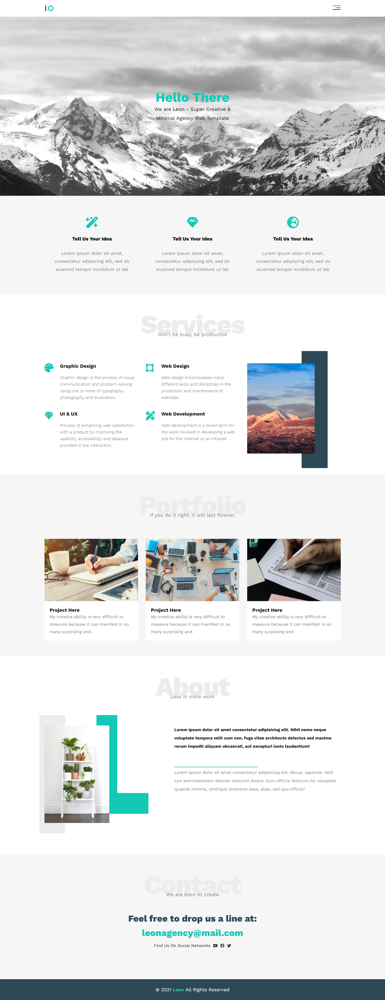

# Project Title

Leon

## Project Description

Website Template using HTML5 and CSS3

## Table of Contents

- [Installation](#installation)
- [Usage](#usage)
- [URL](#url)
- [Technologies](#technologies)
- [Credit](#credit)
- [Author](#author)

## Installation

1- Clone the repository:
git clone https://github.com/Abdalrzakalsouki/Leon-Template.git

## Usage

## url

Live Site URL: (https://leon-template.onrender.com)

## Technologies

- CSS3
- HTML5

## Credit

[unknown](https://www.graphberry.com/item/leon-psd-agency-template)

## author

- LinkedIn - [@abdulrazzakalsssouki](https://www.linkedin.com/in/abdulrazzakalsssouki)
